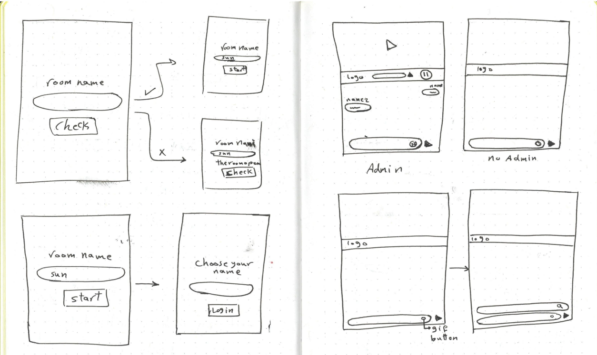
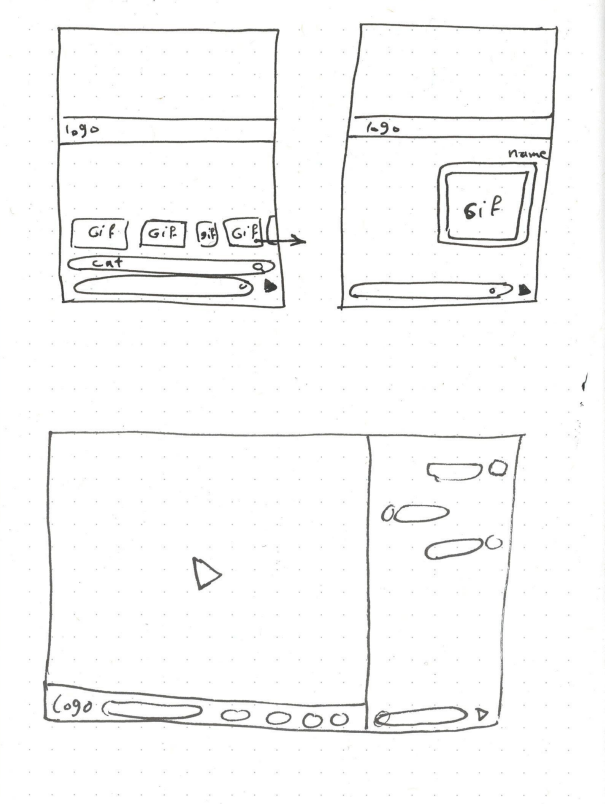
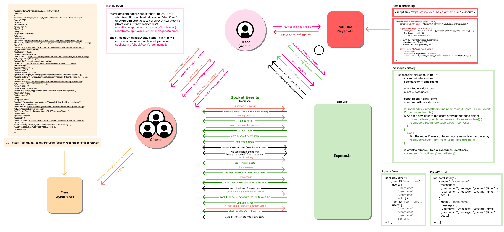

# Real time web
During this course we will learn how to build a real-time application. We will learn techniques to setup an open connection between the client and the server. This will enable us to send data in real-time both ways, at the same time.

## Streamy-Chan


## 🛠️ Features Combined 

- Open a private room ✅
- No other person can open a room in the same room ✅
- username choosing  ✅
- Can choose a avatar foto (from standard list) ✅
- Members cannot have the same names in a single chat ✅
- The member who opens the room is the admin (the first to join the chat) ✅
- If the admin leaves, the next joiner becomes the admin ✅
- Chat together ✅
- Send GIFs ✅
- Watch videos from YouTube collectively ✅
- See new joiners ✅
- See connection status ✅
- See the name busy writing ✅
- Day and night mode depending on the device mode ✅
- Share the video link in the chat when it is sent to everyone ✅
- New joiners can get chat history ✅
- When joining with the same name, when reconnecting, the member's messages are displayed in the same direction as him ✅
- Include the time the message was sent (not in the chat history) ✅
- When all room members leave, the room is deleted from the server ✅


## 👁️ Demo Link! 
 
* live demo door [railway.app](https://rtw-groep-production.up.railway.app/)
<!-- * live demo door [aptable.io](https://streamy-chan.adaptable.app) -->

---

## 🖊 Concept 
Streamy-Chan is an app where the users can open their own room and chat with their friends and watch something on youtube or websites by forming a link.


---

## 📖 Job Story 
As a social media user, I want to connect with my faraway friends and family through a secure chatting app, so that I can easily communicate with them and watch videos or listen to music while chatting together.

---

- [Real time web](#real-time-web)
  - [Streamy-Chan](#streamy-chan)
  - [🛠️ Features Combined](#️-features-combined)
  - [👁️ Demo Link!](#️-demo-link)
  - [🖊 Concept](#-concept)
  - [📖 Job Story](#-job-story)
  - [💻 Intallation Guide](#-intallation-guide)
    - [Install nvm](#install-nvm)
    - [Clone repo](#clone-repo)
    - [NPM install](#npm-install)
    - [Start server](#start-server)
  - [💾 Used Technologies](#-used-technologies)
  - [Process](#process)
    - [Getting started with socket.io](#getting-started-with-socketio)
  - [Process](#process-1)
    - [Choosing idea](#choosing-idea)
    - [Sketching](#sketching)
    - [API's](#apis)
  - [MOSCOW methode](#moscow-methode)
    - [Must have](#must-have)
    - [Should have](#should-have)
    - [Could have](#could-have)
    - [Would have but not right now](#would-have-but-not-right-now)
  - [Data modeling](#data-modeling)
    - [Real time events](#real-time-events)
  - [UI Stack](#ui-stack)
    - [Online](#online)
    - [Online (error)](#online-error)
    - [Room check loading](#room-check-loading)
    - [Room is open (error)](#room-is-open-error)
    - [Username check (error if the username is not available)](#username-check-error-if-the-username-is-not-available)
    - [start chat loading](#start-chat-loading)
  - [Sources](#sources)


---

## 💻 Intallation Guide 
### Install nvm
1. To install the server you need node and express. You can do that with nvm. Nvm is package installer where you can install different packages. With this code you can install the latest versions of npm and node in your terminal:
```
nvm install 19.8.1
```

### Clone repo
2. Clone this repository by running:
```
git clone https://github.com/SundousKanaan/RTW-Groep.git
```

### NPM install
3. Install the dependencies by running:
```
npm install 
```

### Start server 
Run the following code to start the server: 
```
node app.js
```

---

## 💾 Used Technologies 
* EJS templating engine
* Express
* Socket.io
* [Gfycat’s API](https://developers.gfycat.com/api/#updating-gfycats) 🔗

---

## Process
### Getting started with socket.io
<details>

1. The first goal is to set up a simple HTML webpage that serves out a form and a list of messages. We’re going to use the Node.JS web framework express to this end. Make sure Node.JS is installed.

```
npm install express@4
```

2. Once it's installed we can create an index.js file that will set up our application.
```js
const express = require('express');
const app = express();
const http = require('http');
const server = http.createServer(app);

app.get('/', (req, res) => {
  res.send('<h1>Hello world</h1>');
});

server.listen(3000, () => {
  console.log('listening on *:3000');
});
```

3. Integrate socket.io 
```
npm install socket.io
```

4. That will install the module and add the dependency to package.json. Now let’s edit index.js to add it:
```js
const express = require('express');
const app = express();
const http = require('http');
const server = http.createServer(app);
const { Server } = require("socket.io");
const io = new Server(server);

app.get('/', (req, res) => {
  res.sendFile(__dirname + '/index.html');
});

io.on('connection', (socket) => {
  console.log('a user connected');
});

server.listen(3000, () => {
  console.log('listening on *:3000');
});
```

5. Add a script tag in your index.ejs file for.
```html
<script src="/socket.io/socket.io.js"></script>
```

7. To see connections and disconnections add this code to your server.js
```js 
io.on('connection', (socket) => {
  console.log('a user connected');
  socket.on('disconnect', () => {
    console.log('user disconnected');
  });
});

``` 

</details>

---

## Process

I started thinking about my concept that I would build and I had 3 ideas:

- Use a free Pokemon API to build the game "Who is this Pokemon?"
- Use a free Harry Potter series API to build a game of guessing the name of the spell by its caption.
- A room to watch videos collectively and chat together
- 
### Choosing idea

The stream room was the most exciting for me, because I watch anime with my friends at the same time, but not collectively in one place, and we have to make a note that we started the episode to start almost together, and this is sometimes bad because we miss direct interactive chat while watching.

### Sketching
<details>

I drew the main pages and the link between them in a simple way, and how it will look between the admin and the regular member




- **App notes**
  * Room state check
  * Admin view is with stream controles
  * Chat users view without stream controles
  * send gif's 
  * mobile view is column but big screens row

</details>

### API's

**API's Features**

<details>

1. YouTube Iframe API
   - Making a special frame for the player through the id of the YouTube link
   - Start the player via a separate button using "play Video() & stopVideo()"

  It also provides data about the video, such as the title of the video and others, but what matters to me is the id of the video.

2. Gfycat API
   - Search in a few different languages
   - jive address
   - GIF image in several different qualities
   Classification of carrion
   - And other data related to carrion
   I used the highest quality gif available and also the gif title

</details>

## MOSCOW methode

<details>

### Must have
- Users can create private rooms for their group ✅
- Users can create username ✅
- Users will be placed on a user list ✅
- Admin for each room and he has the controls of the streaming. ✅
- You can see who is online. ✅
- Users can communicate with each other in a group chat. ✅
- Users can watch youtube video together ✅
- Messages are saved ✅
- Data life cycle diagram ✅
  
### Should have
- Instruction how to use the app (zero state)
  - paper sketch ✅
- Must be working on mobile ✅
- Offline support ✅
- responsive app ✅
- light/dark mode (system check) ✅
- Newly joined users can see the chat history ✅ 
  - (Hosting probleem so it may not work properly in the online version now)
- Choose an avatar image ✅
- Notification of the validity of the video link ✅

### Could have
- Users can get a message when the link of the video is good  ✅
- Users can get a message when the link of the video is not good ✅
- Users are notified that someone has been involved ✅
- Users can share GIFs ✅
- 
### Would have but not right now
- wachtwoord de room maken
- Gebruikers kunnen stickers delen
- Streaming websites door hun link
- geluid calls
- video calls
- snel reactions
- dark/light mode door een knop
- Upload an avatar image from the user's device

</details>

## Data modeling



My data lifecycle diagram contains the events that occur during the use of the application and the types of exchanges that occur between users, the server and the associated API's.

### Real time events


<details>

`Connection`
When the user connects to the server, the connection event is triggered. The server sends a message to the client confirming that the user is successfully connected to the server.

```JavaScript
//server.js
io.on('connection', (socket) => {
    console.log('a user connected');
    socket.emit('connection', 'You are connected to the server');

    // Meerder socket events
    socket.on('disconnect', () => {
        console.log('user disconnected');
    });
});
```

`New room`
When checking that the room name is not in the server's memory, the name is added to the memory and the room is opened.

```JavaScript
// server.js
  socket.on('checkRoom', (roomname) => {
    console.log("openRoomName", roomname);

    let roomIndex = roomUsers.findIndex(room => room.ID === roomname);

    for (const [index, room] of Object.entries(roomUsers)) {
      if (room.ID === roomname) {
        roomIndex = index;
        break;
      }
    }
```


</details>

## UI Stack

<details>

### Online
### Online (error)
### Room check loading
### Room is open (error)
### Username check (error if the username is not available)
### start chat loading

</details>


## Sources
* https://www.npmjs.com/package/nodemon 
* https://fonts.adobe.com/fonts/interstate 
* https://www.git-tower.com/learn/git/faq/git-pull-origin-master
* https://adaptable.io/ 
* https://railway.app/ 
* https://socket.io/get-started/chat/ 


